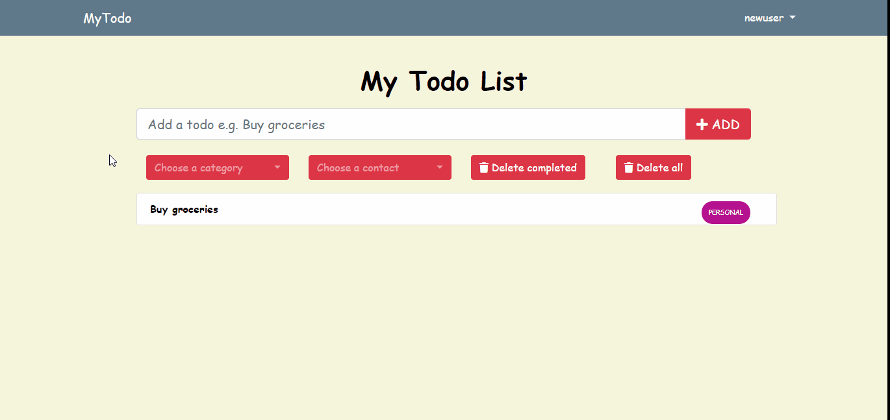

# Django-Todo-Website
This website is a basic todo list for users to list the things that they need to do! Users are able to categorize their tasks using default categories which are: Home, Work, School, Cleaning, and Personal. Users can also add contacts and remind them of tasks via email. Examples of the use of this feature is to remind people of events and important appointments. NOTE THIS WEBSITE IS NOT LIVE.

# Resources Used
Below are the python libraries, frameworks, and other technologies that I used to create this project:
* Python
* HTML and CSS
* Django - **pip install Django**
* Django Crispy Forms (Stylize built-in Django forms) - **pip install django-crispy-forms**
* Bootstrap (For stylizing) - **https://getbootstrap.com/docs/4.3/getting-started/introduction/**
* Bootstrap-Select (To stylize "Select" html element) - **https://developer.snapappointments.com/bootstrap-select/**
* Fontawsome (For icons) - **https://fontawesome.com/**

# How it works
When you first visit the website you will be greeted with the homepage, shown below, where your Todo list resides. However, you will need register an account before adding anything to your Todo list. Registering for an account requires a username, email, and a password. Once registered, the user can login and start addings tasks to their todo list and adding new contacts. Notice once a user is logged in, the navbar options change to reflect the choices that a logged in user has.

Once logged in, the user will be able to add tasks to their Todo list by simply typing what their task in the text box and clicking add. Users are able to categorize the task by default categories which are listed above and are able to select a contact or contacts they have saved to remind them of the task.

In order to take advantage of the feature of reminding others of a task, users will need to add them to their saved contacts. This is very simple to do, users will only need to provide a full name and an email in order to save someone as a contact and be able to remind them of furture tasks.

Once the user had added a contact or contacts they will be able to remind them of a task via email. When adding a task, users simply find the contact or contacts they want to remind thorugh the "Choose a contact" dropdown menu. Emails will be sent once the user as added the task.

Finally, you can logout by clicking the "logout" option in the navbar which will redirect you to the logout option where you will have the option to login in case you logged out by accident.

# Things that can be added:
- Invitation/Remind feature: Users would be able to invite/remind others about a todo such as an event they are attending.
- Organizing Task: User is able to organize the things they need to do by a category.
